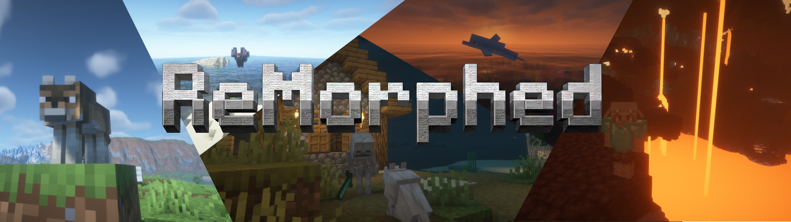
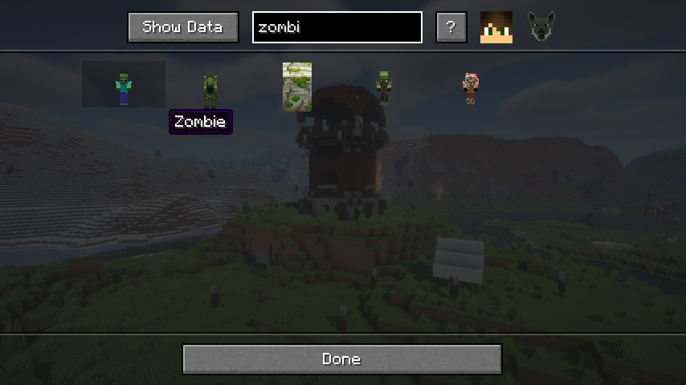
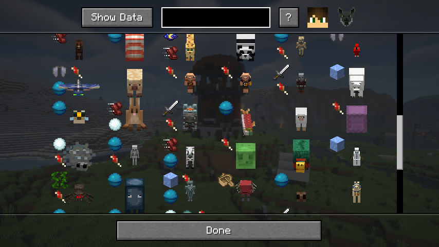

> **Want to morph into other players too?** Install [SkinShifter](https://modrinth.com/mod/skinshifter).

# ReMorphed

**The definitive morph mod for modern Minecraft.** Kill mobs to unlock their form — then use their traits, abilities, and movement. ReMorphed has been in active development for 3 years and goes far beyond a simple port.

> ReMorphed is built on [Walkers](https://modrinth.com/mod/woodwalkers) and [CraftedCore](https://modrinth.com/mod/crafted-core) —it started as a fork of the Identity mod and developed into something entirely own.
> It is a ground-up reimplementation with a full **Trait System**, a proper morph **menu**, and ongoing compatibility work.

## Why ReMorphed?

| Feature                            | ReMorphed                                                              | other Morph mods / Identity ports |
|------------------------------------|------------------------------------------------------------------------|-----------------------------------|
| In-game morph menu                 | ✅                                                                      | Partial                           |
| balanced gameplay                  | ✅ (unlocked mobs "vanish" after 5x morphing per kill)                  | ❌                                 |
| Morph into Players                 | ✅ (with [SkinShifter](https://modrinth.com/mod/skinshifter) installed) | ❌                                 |
| Trait System (passive abilities)   | ✅                                                                      | ❌                                 |
| highly configurable                | ✅                                                                      | ❌                                 |
| highly customizable via Data Packs | ✅                                                                      | ❌                                 |
| detailed wiki guides for players   | ✅                                                                      | ❌                                 |
| Active development                 | ✅ since 2023                                                           | Varies                            |
| modern, easy to understand API     | ✅                                                                      | ❌                                 |
| License                            | LGPL-3.0 (open)                                                        | Often All Right Reserved          |
| FOSS                               | ✅ Free forever & public source code                                    | Varies                            |

... and many other features!

## Getting Started

1. **Hunt** — find a mob in the wild and kill it.
2. **Unlock** — the mob is now saved to your collection.
3. **Open the Menu** — press `^` to browse your unlocked morphs.
4. **Transform** — select a morph and press `G` to shift.

> ⚠️ **Note:** Woodwalkers' built-in unlock method is disabled when ReMorphed is installed. This mod replaces it entirely.

## Trait System

Each mob form comes with its own passive traits — not just the shape. Swim faster as a fish, climb walls as a spider, survive falls as a cat. The trait system is ReMorphed's core feature and is continuously expanded.
Most traits have a unique symbol so you know which mob has which traits! The symbols are explained in the [wiki](https://github.com/ToCraft/woodwalkers-mod/wiki/Traits).

## Requirements

| Mod | CurseForge | Modrinth |
|---|---|---|
| CraftedCore | [Download](https://www.curseforge.com/minecraft/mc-mods/crafted-core) | [Download](https://modrinth.com/mod/crafted-core) |
| Walkers | [Download](https://www.curseforge.com/minecraft/mc-mods/woodwalkers) | [Download](https://modrinth.com/mod/woodwalkers) |

## Download ReMorphed

## License

ReMorphed is licensed under [LGPL-3.0](https://www.gnu.org/licenses/lgpl-3.0.html) — free to use, modify, and include in modpacks.
